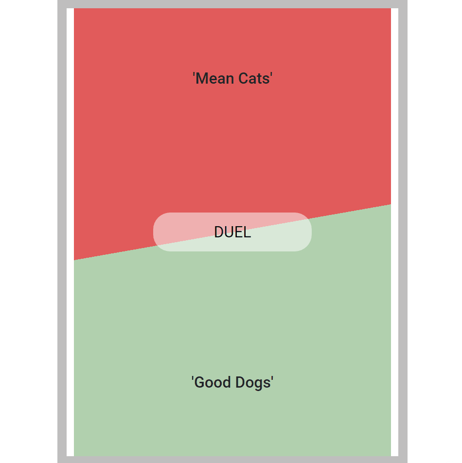

# api-hackathon

A hackathon project utilizing the data from two public APIs to create a dog vs cat app.

# Technologies Used

- HTML5
- CSS3
- JavaScript

# Live Demo

https://zack-kern.github.io/api-hackathon/

# Features

- User can view app
- User can play app
- User can restart app

# Preview

